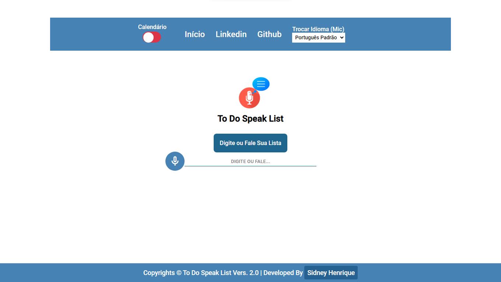
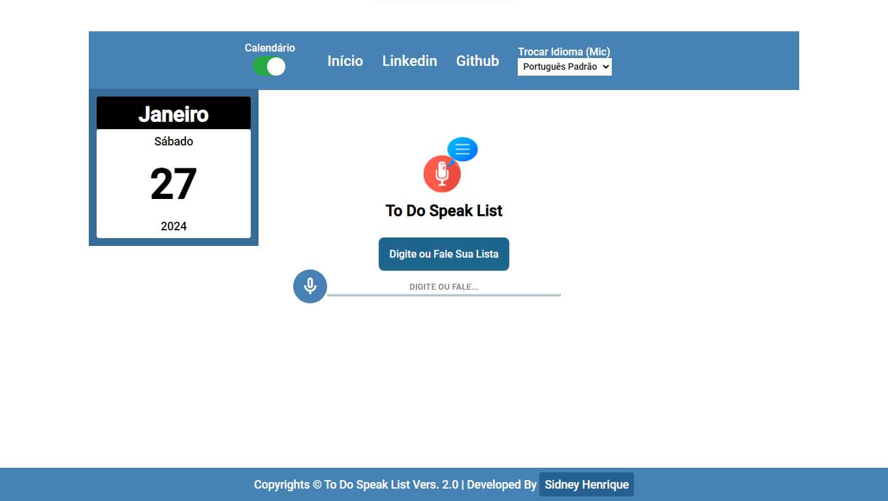
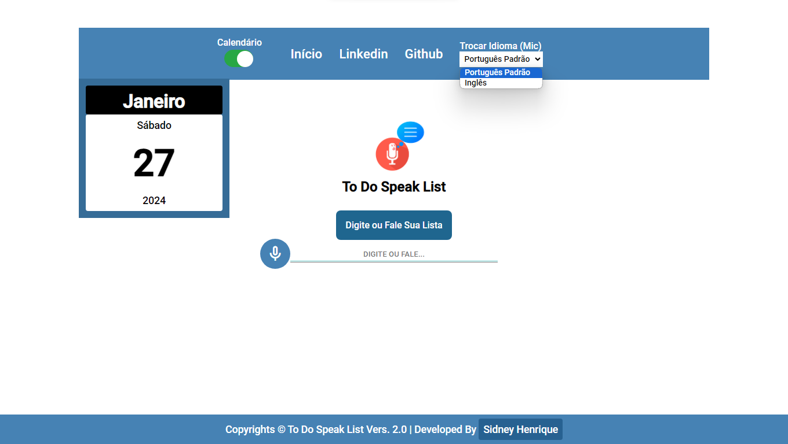
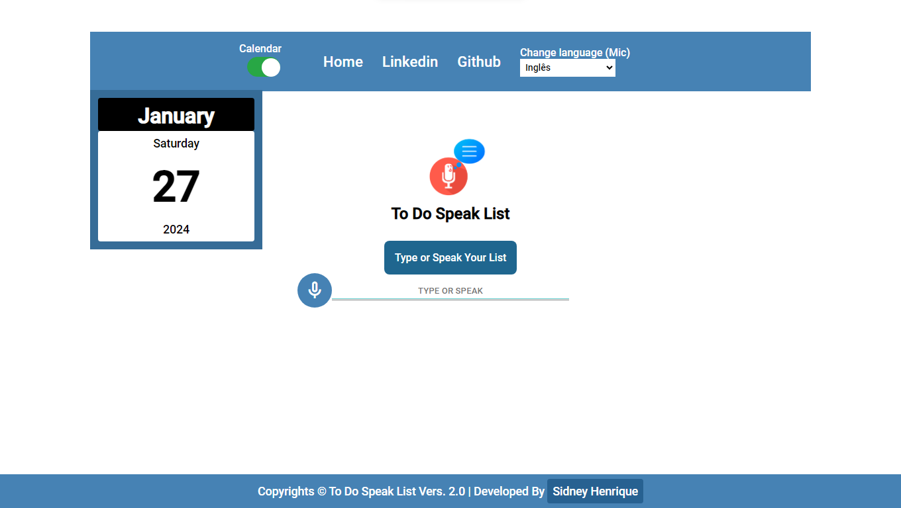
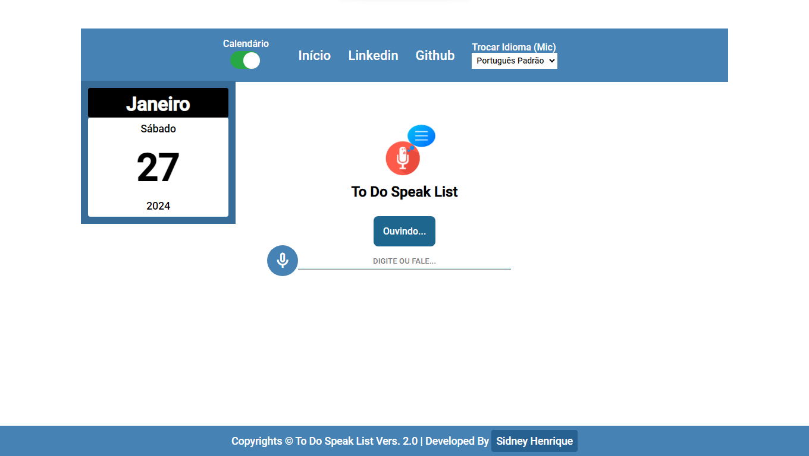

# To-Do Speak List

Um simples aplicativo de lista de tarefas criado com HTML, CSS e JavaScript, permitindo aos usuários criar e gerenciar suas tarefas por meio de comandos de voz ou entrada manual.

## Como Usar

1. Clone o repositório em sua máquina local:

    ```bash
    git clone https://github.com/sidneyhenriquedev/todospeaklist/.git
    cd nome-do-repositorio
    ```

2. Abra o arquivo `index.html` em um navegador web.

## Funcionalidades

- Crie tarefas por meio de comandos de voz.
- Adicione e remova tarefas manualmente.
- Suporte para os idiomas Português e Inglês.

## Capturas de Tela



## Captura de Tela 2


## Captura de Tela 3


## Captura de Tela 4


## Captura de Tela 5


## Requisitos

- Navegador web moderno.
- De Preferencia Google Chrome

- ## TESTE A APLICAÇÃO AQUI A BAIXO!
- <a href="https://sidneyhenriquedev.github.io/todospeaklist/">Clique Para Testar</a>

## Recursos

- [Documentação HTML](https://developer.mozilla.org/en-US/docs/Web/HTML)
- [Documentação CSS](https://developer.mozilla.org/en-US/docs/Web/CSS)
- [Documentação JavaScript](https://developer.mozilla.org/en-US/docs/Web/JavaScript)

## Contribuição

Contribuições, problemas e melhorias são bem-vindos.

## Licença

Este projeto faz parte de meus estudos na area da programacao ou seja use como quiser ele é livre.
